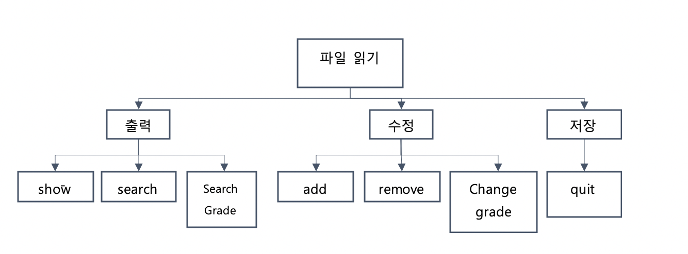
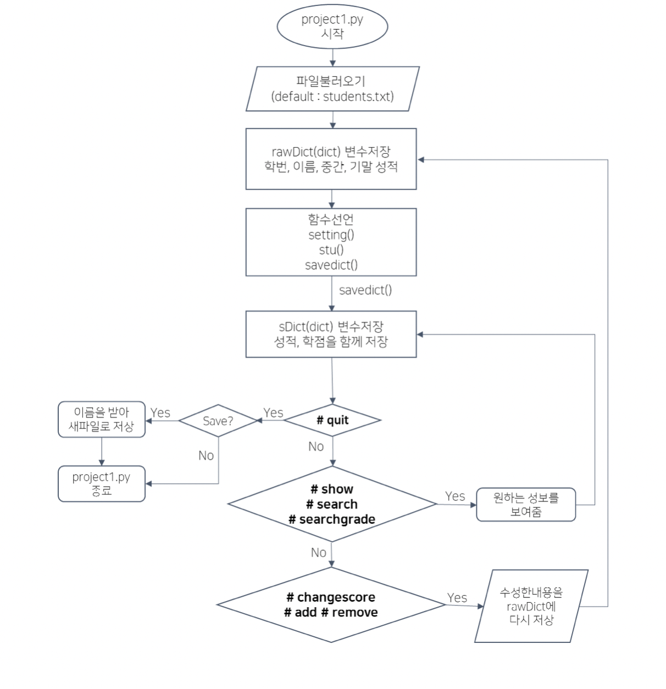

# 학생 성적관리 프로그램

학생 성적 파일을 불러와서 관리하는 프로그램입니다.

###### 파일 구성

학생 id, 이름, 중간고사 성적, 기말고사 성적

###### 기능

- #show, #search, #SearchGrade 는 조건에 맞는 데이터를 출력해주는 명령어이다.
- #add, #remove, # changeGrade 는 데이터를 수정해주는 명령어이다.
- #quit 은 프로그램을 종료하는 명령어이다.
- 종료하기 전, 파일 저장 여부를 물은 뒤 새로운 파일로 저장시켜준다.

> 구조차트 (structure chart)

> FlowChart

##### 프로그램 구조 및 설명

먼저, if __name__ == ‘__main__’ : 부분에서부터 프로그램이 시작된다.

파일을 불러온다.(default : students.txt)

학생 id, 이름, 중간고사 성적, 기말고사 성적을 rawDict 변수에 저장한다. 기본적으로 학생 id를 key값으로 가지는 딕셔너리를 이용하여 정보를 저장하였다.

부가적인 함수를 만든다.

1. Setting() : 파일 출력시 표의 인덱스 부분과 점선모양을 출력해주는 함수이다.

2. Stu(id, sDict) : 학생의 id와 딕셔너리를 input 값으로 넣어주면 학생 id에 맞는 딕셔너리 정보를 한 줄로 예쁘게 출력해준다.

3. saveDict(rawDict) : rawDict의 정보에서 학생의 평균과 학점을 계산하여 추가해 만든 딕셔너리를 리턴해준다.

While True:

​     Main()

​     sDict = saveDict(rawDict)

 

while 문을 통해 사용자로부터 옵션을 선택받는 main 함수를 계속 실행해준다. Main 함수에는 7가지의 옵션 함수들이 존재한다. main함수의 리턴값인 rawdict를 받아 평균과 학점의 추가정보를 가공한 sDict 로 저장해준 뒤, 새롭게 저장된 딕셔너리로 main함수를 다시 실행한다.

 

7개의 함수인 # show, # search, # searchgrade, # changescore, # add, # remove, #quit 는 사용자의 입력에 따라 실행해준다.
